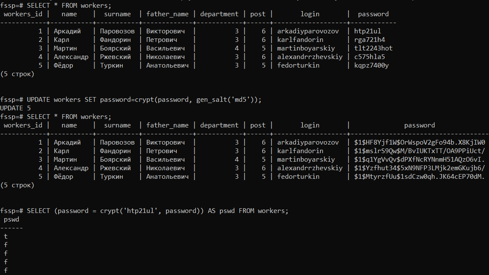
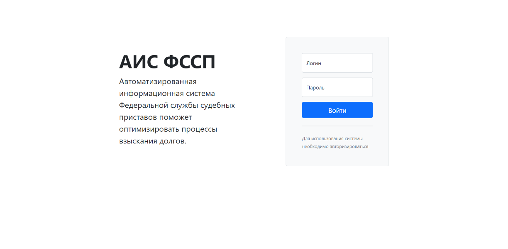
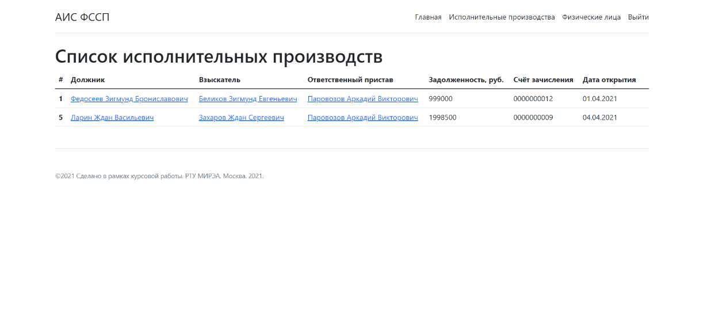

# Автоматизированная информационная система Федеральной службы судебных приставов

Данная курсовая работа не является попыткой реализовать или улучшить действующую АИС ФССП. Проект разработан в учебных целях.

# Содержание

[**Задание**](#Task)  
[**Введение**](#Intro)  
[**Глава 1. База данных**](#Сhapter1)  
* [1.1. Описание предметной области](#Subject-area)  
  * [1.1.1. Характер деятельности ФССП](#About-FSSP)  
  * [1.1.2. Порядок приёма заявления об открытии исполнительного производства](#Acceptance)  
  * [1.1.3. Входящие данные](#Input)  
  * [1.1.4. Исходящие данные](#Output)  
* [1.2. ER-модель предметной области](#ER-model)  
* [1.3. Реализация БД на базе PostgreSQL](#PostgreSQL-realization)  
  * [1.3.1. Создание основной структуры базы данных](#Structure)  
  * [1.3.2. Схемы и роли](#Shema-role)  
  * [1.3.3. Шифрование](#Encryption)  
  * [1.3.4. Оптимизация взаимодействия с базой данных с помощью процедур, функций и триггеров](#Optimization)  
    
[**Глава 2. Графический интерфейс**](#Сhapter2)  
[**Заключение**](#Conclusion)  
[**Список источников**](#Sources)  
[**Ссылки на исходный код**](#Source-code)

# <a name="Task"></a> Задание

В данной работе необходимо спроектировать базу данных в рамках автоматизированной информационной системы для возможности электронного взыскания долгов службой [ФССП](https://fssp.gov.ru). Следует разработать графический пользовательский интерфейс. При этом должен быть реализован многопользовательский режим с разграничение прав доступа. В разработанном программном обеспечении необходимо реализовать защиту данных от SQL-инъекций и дополнительно осуществлять [хранение особо важных данных в зашифрованном виде](#Encryption). В заключении работы требуется подготовить полную документацию проекта, включая [код программы](fssp_app) и скриншоты работы приложения.

# <a name="Intro"></a>Введение

Цель данного курсового проекта – разработка базы данных для оптимизации процесса электронного взыскания долгов судебными приставами, автоматизации документооборота в [ФССП](https://fssp.gov.ru).

Цифровизация государственных органов делает их деятельность более продуктивной и позволяет улучшить процесс взаимодействия с гражданами. Разработка баз данных для централизованного хранения информации один из важных элементов процесса цифровизации. Для удобства взаимодействия сотрудников с базой данных (чтения, редактирования и удаления информации) разрабатываются информационные системы с поддержкой графического интерфейса.

# <a name="Сhapter1"></a>Глава 1. База данных

## <a name="Subject-area"></a>1.1. Описание предметной области

### <a name="About-FSSP"></a>1.1.1. Характер деятельности ФССП

Взысканием всех видов документально оформленных задолженностей в Российской Федерации занимается [Федеральная служба судебных приставов](https://fssp.gov.ru/). Данная организация берёт на себя выполнение всех исполнительных производств, обеспечивая соблюдение прав взыскателей. Юридическим и законодательным обоснованием деятельности приставов выступают Федеральные законы [№229](https://fssp.gov.ru/2032946) и [№118](http://www.consultant.ru/document/cons_doc_LAW_15281/). При этом действия судебных приставов строго регламентированы.

[ФССП](https://fssp.gov.ru/) может начинать свою работу по решению суда про принудительное взыскание каких бы то ни было долгов. Также в отдельных случаях, допустимо начало исполнительных производств (ИП) по обращению взыскателей с предъявлением ими соответствующих документов. Таковыми случаями может быть взыскание задолженностей по алиментам при наличии у взыскателя соответствующего судебного решения или приказа, либо – заверенного нотариально соглашения об алиментарных выплатах. Порядок действий, в котором взыскиваются задолженности, регламентируется законодательством. Обращение к [ФССП](https://fssp.gov.ru/) по исполнительному листу может совершить как непосредственно орган правосудия, направив таковой лист прямиком в [ФССП](https://fssp.gov.ru/) после оглашения решения, так и сам взыскатель, если таковой лист был выдан ему на руки.

Выданный на руки исполнительный лист позволяет взыскателю не только обратиться в [ФССП](https://fssp.gov.ru/) для получения причитающихся средств, но и осуществить действия по взысканию самостоятельно. В таком случае допускается обращение взыскателя с исполнительным листом в банк должника, либо – по месту его работы, но только в ситуациях, когда общий размер задолженности составляет менее 25 тыс. рублей.

Лицо, имеющее на руках исполнительный лист, выданный судом, а также другие документы, способные служить обоснованием для начала исполнительного производства касательно взыскания с должника, должно обратиться в отделение [ФССП](https://fssp.gov.ru/). При этом таковое отделение обязано находиться:

- По месту проживания или нахождения должника;
- По месту открытия его банковских счетов;
- По месту расположения имущества.

После получения судебного листа или заявления про открытие исполнительного производства на основании других документов, судебный пристав обязан выдать расписку о получении такового обращения, а также в течение трех дней открыть исполнительное производство, о чем уведомляется как взыскатель, так и должник. При этом общий срок ожидания может составить шесть дней, если заявление про открытие исполнительного производства предоставляется в [ФССП](https://fssp.gov.ru/), а не конкретному приставу-исполнителю. Три дня отводится [ФССП](https://fssp.gov.ru/) на направление исполнительного листа и документов непосредственно судебному приставу-исполнителю (СПИ), а еще три дня – на открытие ИП.

К заявлению и исполнительному листу взыскатель обязан приложить реквизиты своего банковского счёта, на который будут переводиться взыскиваемые средства. Также, если исполнительное производство по конкретной задолженности открывается впервые, судебным приставом предоставляется срок с возможностью добровольного закрытия должником задолженности. Таковые сроки составляют пять суток с момента получения лицом с задолженностью уведомления от представителя [ФССП](https://fssp.gov.ru/).

Органы правосудия могут установить дополнительный срок для добровольного погашения задолженности. В случае если ИП уже действует или открывается не в первый раз, либо если задолженность не была погашена в течение допустимого для добровольного погашения срока, СПИ обязан произвести меры по её взысканию в течение двухмесячного срока. На протяжении этого срока, а также по его окончанию, взыскатель может потребовать от пристава отчет о проведенных действиях по взысканию и в случае неудовлетворительной работы представителей [ФССП](https://fssp.gov.ru/) может обратиться в прокуратуру.

СПИ для взыскания задолженности проводятся следующие действия в установленном порядке:

1. Со времени получения исполнительного листа пристав имеет три дня для открытия исполнительного производства. Постановление про его открытие направляется им взыскателю и должнику.

2. Пристав предоставляет пятидневный либо другой, установленный в судебном порядке срок для добровольного закрытия долговых обязательств, в случае если подобное ИП открывается впервые.

3. Следующим этапом действий СПИ является поиск денежных средств должника. Для этого направляются запросы в различные банковские организации и по месту его работы. Счета подлежат временному аресту для блокировки возможного движения денежных средств до закрытия исполнительного производства.

4. Если денежные средства найдены, задолженность изымается непосредственно с банковского счёта или доходов должника. В противном случае судебный пристав продолжает свою работу и устанавливает наличие у должника недвижимого и движимого имущества.

5. Как только имущество должника установлено, на него накладывается арест, и оно подвергается оценке и последующей реализации. При этом если стоимость имущества в ходе реализации превышает размер задолженности и исполнительного сбора, разница в стоимости возвращается должнику.

6. В ситуациях, когда размер задолженности превышает 10 тыс. рублей, судебный пристав-исполнитель может наложить на должника запрет на выезд за границу.

7. После совершения взыскания задолженности, пристав также взыскивает с должника исполнительный сбор (если задолженность не была погашена в течение добровольного срока). Размер такового сбора составляет 7% от общей суммы задолженности, но не менее, чем 1 тыс. рублей для должников-физических лиц и не менее 10 тыс. рублей для юридических лиц.

8. Как только задолженность и исполнительный сбор взысканы в полном размере с должника, его денежных средств или имущества, ИП закрывается. Взыскатель вправе контролировать течение ИП и направлять судебному приставу требование об осуществлении любого из вышеуказанных действий.

### <a name="Acceptance"></a>1.1.2. Порядок приёма заявления об открытии исполнительного производства

Сначала на основании решения суда или другого уполномоченного органа, которое представлено исполнительным листом, принимается анкета заявления физического лица о возбуждении исполнительного производства в отношении другого физического лица в отделении [ФССП России](https://fssp.gov.ru/). При этом подаётся заявление о предъявлении исполнительного листа на рассмотрение реквизиты банковского счёта и копия паспорта взыскателя. В ответ взыскателю выдаётся расписка о приёме указанных документов и начале ИП.

### <a name="Input"></a>1.1.3. Входящие данные

1. Информация об органе ФССП, возбуждающего исполнительное производство  
	1.1. Наименование отдела  
	1.2. Адрес отдела  
2. Информация о взыскателе  
	2.1. Фамилия  
	2.2. Имя  
	2.3. Отчество  
	2.4. Почтовый адрес  
	2.5. Реквизиты банковского счёта (для перечисления возвращённых денежных средств)  
	2.6. Контактный телефон  
3. Сведения о должнике (для поиска источников для взыскания задолженности)
	3.1. Фамилия  
	3.2. Имя  
	3.3. Отчество  
	3.4. Адрес места жительства  
	3.5. Адрес(а) нахождения движимого и недвижимого имущества  
	3.6. Место работы  
	3.7. Телефон  

4. Данные исполнительного листа  
	4.1. Серия  
	4.2. Номер  
	4.3. Дата выдачи
	4.4. Наименование суда  
	4.5. Почтовый адрес суда  
	4.6. Сумма задолженности  
	4.7. Ходатайство взыскателя о наложении ареста на имущество или установлении ограничений на должника  

### <a name="Output"></a>1.1.4. Исходящие данные

1. ФИО пристава, принявшего документы  
2. Данные об отделе ФССП    
	2.1. Наименование  
	2.2. Адрес отдела  
	2.3. Телефон  
3. Статус решения пристава (возбуждение ИП/отказ и причина отказа)

## <a name="ER-model"></a>1.2. ER-модель предметной области

Рис. 1.2.1 – ER-диаграмма разработанной базы данных.


Синим цветом отмечены таблицы, доступ к которым будет у работников [ФССП](https://fssp.gov.ru/). К красным таблицам доступ будет только у администраторов БД.

## <a name="PostgreSQL-realization"></a>1.3. Реализация БД на базе PostgreSQL

### <a name="Structure"></a>1.3.1. Создание основной структуры базы данных

Разработанная база данных состоит из 14 таблиц. В таблице _workers_ будут храниться, данные о работниках [ФССП](https://fssp.gov.ru/). У каждого работника есть должность, перечень которых указана в таблице _post_. Также каждый работник относится к определённому отделу [ФССП](https://fssp.gov.ru/), данные о котором хранятся в таблице _department_.Перечень исполнительных производств храниться в таблице *enforcement_proceeding*. У каждого исполнительного производства должен быть ответственный пристав. Все платежи по возврату долгов сохраняются в _payment_. Информация о судах хранится в _court_. Каждое исполнительное производство привязано к банковскому счёту, на который будут перечисляться возвращённые денежные средства. Все банковские счета сохранены в таблице *bank_accaunt*. Личная информация о должниках и взыскателях храниться в таблице _person_. Для удобства взыскания долгов в property сохранены данные о имуществе должников. Должники, взыскатели, отделы [ФССП](https://fssp.gov.ru/), суды, банковские счета и имущество связаны с адресом, которые сохранили в таблице _address_. _area_ – таблица с перечнем областей, _country_ – с перечнем стран, _currency_ – хранит данные о валютах. Для создания описанной выше базы данных использована реляционная система управления базами данных [PostgreSQL](https://www.postgresql.org/).

Листинг 1.3.1.1. – Код для создания базы данных.

```sql
CREATE DATABASE fssp;

--создание таблицы должностей
CREATE TABLE post
	(
		post_id SERIAL NOT NULL PRIMARY KEY,
		name VARCHAR(30) NOT NULL
	);

--создание таблицы работников
CREATE TABLE workers
	(
		workers_id SERIAL NOT NULL PRIMARY KEY,
		name VARCHAR(30) NOT NULL, 
		surname VARCHAR(30) NOT NULL,
		father_name VARCHAR(30),
		department INT NOT NULL,
		post INT NOT NULL,
		login VARCHAR(30) NOT NULL,
		password VARCHAR(50) NOT NULL
	);

--создание таблицы отделений ФССП
CREATE TABLE department
	(
		department_id SERIAL NOT NULL PRIMARY KEY,
		name VARCHAR(30) NOT NULL,
		address INT NOT NULL,
		phone VARCHAR(14) NOT NULL
	);

--создание таблицы судов
CREATE TABLE court
	(
		court_id SERIAL NOT NULL PRIMARY KEY,
		name VARCHAR(50) NOT NULL,
		address INT NOT NULL
	);

--создание таблицы адресов
CREATE TABLE address
	(
		address_id SERIAL NOT NULL PRIMARY KEY,
		area INT NOT NULL,
		town VARCHAR(168) NOT NULL,
		street VARCHAR(132) NOT NULL,
		house INT NOT NULL,
		corpus INT,
		flat INT
	);

--создание таблицы регионов
CREATE TABLE area
	(
		area_id SERIAL NOT NULL PRIMARY KEY,
		country INT NOT NULL,
		name VARCHAR(60) NOT NULL,
		region INT NOT NULL
	);

--создание таблицы государств
CREATE TABLE country
	(
		country_id SERIAL NOT NULL PRIMARY KEY,
		name VARCHAR(30) NOT NULL
	);

--создание таблицы банковских счетов
CREATE TABLE bank_accaunt
	(
		bank_accaunt_id SERIAL NOT NULL PRIMARY KEY,
		bank_recipient VARCHAR(20) NOT NULL,
		bik VARCHAR(9) NOT NULL,
		kpp VARCHAR(9) NOT NULL,
		department INT NOT NULL,
		currency INT NOT NULL,
		department_address INT NOT NULL,
		person INT NOT NULL
	);

--создание таблицы валют
CREATE TABLE currency
	(
		currency_id SERIAL NOT NULL PRIMARY KEY,
		name VARCHAR(30) NOT NULL
	);

--создание таблицы имущества
CREATE TABLE property
	(
		property_id SERIAL NOT NULL PRIMARY KEY,
		name VARCHAR(20) NOT NULL,
		cost INT NOT NULL,
		address INT NOT NULL,
		owner INT NOT NULL,
		co_owner TEXT
	);

--создание таблицы физических лиц
CREATE TABLE person
	(
		person_id SERIAL NOT NULL PRIMARY KEY,
		name VARCHAR(30) NOT NULL,
		surname VARCHAR(30) NOT NULL,
		father_name VARCHAR(30),
		born_date DATE NOT NULL,
		address INT NOT NULL,
		registration INT NOT NULL,
		phone VARCHAR(14) NOT NULL,
		email VARCHAR(50) NOT NULL,
		number_pasport VARCHAR(10) NOT NULL,
		date_issue DATE NOT NULL,
		department_code INT NOT NULL,
		born_place INT NOT NULL
	);

--создание таблицы исполнительных произзводств
CREATE TABLE enforcement_proceeding
	(
		enforcement_proceeding_id SERIAL NOT NULL PRIMARY KEY,
		court INT NOT NULL,
		responsible INT NOT NULL,
		payment_account INT NOT NULL,
		recoverer INT NOT NULL,
		debtor INT NOT NULL,
		debt INT NOT NULL,
		extradition DATE NOT NULL
	);

--создание таблицы действий судебных приставов
CREATE TABLE action
	(
		action_id SERIAL NOT NULL PRIMARY KEY,
		name VARCHAR(50) NOT NULL,
		proceeding INT NOT NULL,
		worker INT NOT NULL,
		action_date timestamp without time zone NOT NULL
	);

--создание таблицы платежей по исполнительным производствам
CREATE TABLE payment
	(
		id SERIAL NOT NULL PRIMARY KEY,
		amount INT NOT NULL,
		payment_account INT NOT NULL,
		timest timestamp without time zone NOT NULL,
		enforcement_proceeding

);
```

Теперь свяжем созданные таблицы. Для этого применим код, приведённый в листинге 1.3.2.

Листинг 1.3.1.2. – Создание связей между таблицами БД.

```sql
ALTER TABLE workers
ADD FOREIGN KEY (post) REFERENCES post(post_id);

ALTER TABLE workers
ADD FOREIGN KEY (department) REFERENCES department(department_id);

ALTER TABLE department
ADD FOREIGN KEY (address) REFERENCES address(address_id);

ALTER TABLE court
ADD FOREIGN KEY (address) REFERENCES address(address_id);

ALTER TABLE address
ADD FOREIGN KEY (area) REFERENCES area(area_id);

ALTER TABLE area
ADD FOREIGN KEY (country) REFERENCES country(country_id);

ALTER TABLE enforcement_proceeding
ADD FOREIGN KEY (court) REFERENCES court(court_id);

ALTER TABLE enforcement_proceeding
ADD FOREIGN KEY (responsible) REFERENCES workers(workers_id);

ALTER TABLE enforcement_proceeding
ADD FOREIGN KEY (recoverer) REFERENCES person(person_id);

ALTER TABLE enforcement_proceeding
ADD FOREIGN KEY (debtor) REFERENCES person(person_id);

ALTER TABLE action
ADD FOREIGN KEY (proceeding) REFERENCES enforcement_proceeding(enforcement_proceeding_id);

ALTER TABLE action
ADD FOREIGN KEY (worker) REFERENCES enforcement_proceeding(enforcement_proceeding_id);

ALTER TABLE bank_accaunt
ADD FOREIGN KEY (department_address) REFERENCES address(address_id);

ALTER TABLE bank_accaunt
ADD FOREIGN KEY (currency) REFERENCES currency(currency_id);

ALTER TABLE bank_accaunt
ADD FOREIGN KEY (person) REFERENCES person(person_id);

ALTER TABLE person
ADD FOREIGN KEY (address) REFERENCES address(address_id);

ALTER TABLE person
ADD FOREIGN KEY (registration) REFERENCES address(address_id);

ALTER TABLE person
ADD FOREIGN KEY (born_place) REFERENCES address(address_id);

ALTER TABLE property
ADD FOREIGN KEY (address) REFERENCES address(address_id);

ALTER TABLE property
ADD FOREIGN KEY (owner) REFERENCES person(person_id);
```
    
### <a name="Shema-role"></a>1.3.2. Схемы и роли

Для создания многопользовательского режима с разграничением прав доступа создадим схемы и назначим для них роли (см. листинг 1.3.2.1).

Листинг 1.3.2.1. – Создание схем и ролей.

```sql
CREATE SCHEMA admin;
ALTER TABLE post
SET SCHEMA admin;
ALTER TABLE area
SET SCHEMA admin;
ALTER TABLE country
SET SCHEMA admin;
ALTER TABLE currency
SET SCHEMA admin;
CREATE USER admin WITH CREATEDB CREATEROLE PASSWORD 'dbvjjn4-div34hjnc8&';
CREATE USER worker WITH PASSWORD 'b-nf61behv395pqvu7rhv&'
```

### <a name="Encription"></a>1.3.3. Шифрование

Так как хранить пароли в открытом виде небезопасно, в системе используется процесс шифрования паролей пользователей.

Для этого применили [специальную функцию шифрования](https://postgrespro.ru/docs/postgrespro/9.5/pgcrypto#idp138133), которая есть в [PostgreSQL](https://www.postgresql.org/) (см. листинг 1.3.3.1).

Листинг 1.3.3.1. – Шифрование паролей пользователей базы данных

```sql
CREATE EXTENSION pgcrypto;
UPDATE workers SET password = crypt(password, gen_salt('md5'));
```
Рис. 1.3.3.1. – Демонстрация шифрования данных.



Другие персональные данные не шифруются, так как с ними приходится часто работать, а процесс расшифровки занимает определённое количество дополнительных производительных ресурсов. К тому же сотрудники [ФССП](https://fssp.gov.ru/) имеют определённый уровень допуска и проходят тщательный отбор. Рекомендуется периодически проводить в системе аудит безопасности.

[Подробнее о шифровании в PostgreSQL и применении модуля pgcrypto можно почитать здесь](https://postgrespro.ru/docs/postgrespro/9.5/pgcrypto)

### <a name="Optimization"></a>1.3.4. Оптимизация взаимодействия с базой данных с помощью процедур, функций и триггеров.

Процедуры помогают выполнять один и тот же SQL-код многократно с помощью обращения по имени процедуры.

Листинг 1.3.4.1. – Процедура изменения оценочной стоимости имущества.

```sql
CREATE PROCEDURE change_cost(property_id int, new_cost int)
LANGUAGE SQL
AS $$
UPDATE property SET cost = new_cost
WHERE property.property_id = change_cost.property_id;
$$

CALL change_cost(1, 1);
````


Для того, чтобы администраторам базы данных не пришлось выполнять один и тот же процесс написания сложных SELECT запросов для выборки данных удобно создавать представления. В листинге 1.3.4.2. и 1.3.4.3. примеры представлений для разработанной БД. Создадим представление, которое выводит банковский счет, адрес банка, имя и фамилию владельца

Листинг 1.3.4.2. - Представление, которое выводит банковский счет, адрес банка, имя и фамилию владельца

```sql
CREATE OR REPLACE VIEW view_bank_accaunt AS
SELECT bank_recipient, bik, kpp, department, address.town,
 address.street, address.house, address.corpus, address.flat, person.name, person.surname FROM bank_accaunt
JOIN address ON department_address = address_id
JOIN person ON person = person_id;

SELECT * FROM view_bank_accaunt;
```

Листинг 1.3.4.3. - Представление, которое выводит сумму платежей по исполнительным производствам

```sql
CREATE OR REPLACE VIEW view_payments_for_enforcement_proceeding AS
SELECT SUM(amount), enforcement_proceeding.number FROM payment
JOIN enforcement_proceeding ON enforcement_proceeding.number = payment.enforcement_proceeding
GROUP BY enforcement_proceeding.number;
```

Транзакции представляют собой логическую единицу работу с данными. Благодаря ним осуществляется целостность сеансов изменения данных. В листинге 1.3.4.4. приведён пример транзакции, в которой осуществляется обмен собственности в рамках возврата долгов.

Листинг 1.3.4.4. – Транзакция обмена собственностью.

```sql
BEGIN;
UPDATE property SET owner = 5
WHERE property_id = 6;
UPDATE property SET owner = 25
WHERE property_id = 8;
COMMIT;
```

Функции позволяют выполнять операции, которые обычно принимают несколько запросов и циклических переходов в одной функции в базе данных.

Пример функции:

Листинг 1.3.4.5. – функция, которая считает текущий долг с учетом всех платежей
```sql
CREATE OR REPLACE FUNCTION check_dept(enforcement_proceeding_id int)  RETURNS int AS $$
	SELECT debt - (SELECT sum(amount) FROM payment
	WHERE enforcement_proceeding=check_dept.enforcement_proceeding_id)
	FROM enforcement_proceeding
	WHERE enforcement_proceeding_id =check_dept.enforcement_proceeding_id;
$$ LANGUAGE SQL;

```

Триггер — это именованный объект базы данных, который связан с таблицей, и он активируется, когда происходит конкретное событие (например, вставка, обновление или удаление) для таблицы / представлений. В частности, триггеры могут предотвратить некорректное добавление данных.

Листинг 1.3.4.6. – триггерная функция и триггер, который запрещает оплачивать погасившийся долг

```sql
--триггерная функция
CREATE OR REPLACE FUNCTION error()
	RETURNS trigger AS
	$$BEGIN
	IF (check_dept(new.enforcement_proceeding) <= 0 OR new.amount > check_dept(new.enforcement_proceeding)) then
	RAISE NOTICE 'error';
	ELSE
	RETURN NEW;
	END IF;
	END;
	$$
LANGUAGE 'plpgsql';

--сам триггер
CREATE TRIGGER check_dept_tr
	BEFORE INSERT ON payment
	FOR EACH ROW
	EXECUTE FUNCTION error();

```

[Подробнее о создании функций, процедур, триггеров в практической работе №3](../Практические%20работы/Практика%20№3%20-%20Администрирование.md#создание-схем)


# <a name="Сhapter2"></a>Глава 2. Графический интерфейс.

Для удобства взаимодействия пользователей системы (судебных приставов) с базой данных с помощью фреймворка [Flask](https://flask-russian-docs.readthedocs.io/ru/master/) и с использованием HTML и [Bootstrap](https://getbootstrap.com/) было разработано веб-приложение. Ниже приведены скриншоты работы приложения.



Рис 2.1. – Страница авторизации пользователей.

Без авторизации нельзя перейти на другие странице. При вводе ссылки главной страницы приложение автоматические перенаправляет пользователя на страницу авторизации. После авторизации пользователи попадают на главную страницу. Главные страницы работников и начальства [ФССП](https://fssp.gov.ru/) отличаются. Начиная с должности заместителя отдела [ФССП](https://fssp.gov.ru/) можно просматривать статистику по отделу среди приставов. Меню с кнопкой выводится сверху, а вот раздел с приёмом заявлений граждан находится гораздо ниже, так как сотрудники [ФССП](https://fssp.gov.ru/) старших чинов редко занимаются этим процессом. Таким образом, приложение для удобства персонализирует главную страницу под каждого работника. Более того, у рядовых работников ограничен доступ к странице статистики деятельности отдела, что благоприятно скажется на сохранности данных.

Для удобства каждый пристав в разделе «исполнительные производства» видит сводную информацию только по свои исп. производствам.


Рис. 2.2. – Главная страница рядового работника ФССП.


Рис. 2.3. – Главная страница начальства отдела ФССП.



Рис. 2.4. – Страница «Исполнительные производства» одного из пользователей

Из страницы исполнительного производства можно перейти на страницы его участников (пристава, должника и взыскателя). Должников и взыскателей также можно искать на странице «физические лица» с помощью поисковой строки.


Рис. 2.5. – Результат поиска на странице «Физические лица»

Для создания нового исполнительного производства из заявки физических лиц, необходимо заполнить анкету, которая при корректном заполнении передаёт данные их формы в базу данных.

Все страницы веб-приложения отрисовываются с помощью [специального шаблонизатора](https://jinja.palletsprojects.com/en/3.0.x/index.html) библиотеки [Flask](https://flask-russian-docs.readthedocs.io/ru/master/). Некоторые страницы создаются на основе в других. Схема отрисовки страниц в данном проекте представлена на рисунке 2.7.


Рис. 2.6. – Анкета на создание исполнительного производства.


Рис. 2.7. – Схема структуры графической части приложения.

Запускает [все html файлы](fssp_app/templates) файл [app.py](fssp_app/app.py). Запросы к базе данных осуществляет файл [database_manager.py](fssp_app/database_manager.py). Защита от SQL-инъекций организована средствами фреймворка [psycopg2](https://www.psycopg.org/), с помощью которого осуществляются запросы к базе данных.

# <a name="Conclusion"></a>Заключение

В ходе курсовой работы была реализована БД для АИС ФССП для электронного взыскания долгов и автоматизированного приёма заявок на возбуждение исполнительного производства. В ходе работы над проектом был реализован графический веб-интерфейс для удобной работы судебных приставов. Были изучены процессы работы [ФССП](https://fssp.gov.ru/) и основные принципы проектирования БД [PostgreSQL](https://www.postgresql.org/), выработаны навыки разработки фронтенд и бэкенд части веб-приложений.

# <a name="Sources"></a>Список источников

1. Порядок взыскания задолженности судебными приставами [Электронный ресурс] URL: https://pravo.moe/poryadok-vzyskaniya-zadolzhennosti-sudebnymi-pristavami (дата обращения: 29.11.2020)
2. Заявления о возбуждении исполнительных производств и предъявлению исполнительных листов [Электронный ресурс] URL: https://r23.fssp.gov.ru/obr\_isplist (дата обращения: 29.11.2020)
3. Образцы исполнительных листов [Электронный ресурс] URL: https://a-tsm.ru/ispolnitelnie\_listi/obrazchi (дата обращения: 29.11.2020)
4. Образцы заявлений приставам [Электронный ресурс] URL: https://tezisdoki.ru/vziskaniedolgov.php (дата обращения 29.11.2020)
5. PostgreSQL: документация [Электронный ресурс] URL: https://postgrespro.ru/docs/postgresql (дата обращения 31.03.2021)
6. Flask Documentation [Электронный ресурс] URL: https://flask.palletsprojects.com/en/1.1.x (дата обращения 31.03.2021)

# <a name="Source-code"></a>Ссылки на исходный код

* [Полный SQL код для создания базы данных](../sql/fssp.sql)
* [app.py](fssp_app/app.py) - управление Веб-интерфейсом и страницами
* [database_manager.py](fssp_app/database_manager.py) - взаимодействие с базой данных
* [base.html](fssp_app/templates/base.html) - базовый шаблон
* [index.html](fssp_app/templates/index.html) - базовый шаблон для стандартных страниц
* [auth.html](fssp_app/templates/auth.html) - страница авторизации
* [main.html](fssp_app/templates/main.html) - главная страница
* [persons.html](fssp_app/templates/persons.html) - страница с поиском физческих лиц в базе
* [person.html](fssp_app/templates/person.html) - подробная информация о физ. лице
* [workers.html](fssp_app/templates/workers.html) - информация о сотрудниках