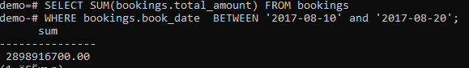

# Лабораторная №1 - Работа со сторонними базами данных. Построение и оптимизация
**Работы в рамках дисциплины:**

[Клиент-серверные системы управления базами данных](../README.md) 

**Следующая работа:**

[Лабораторная №2-5 - Управление контактами с клиентами](./Лабораторная%20№2-5%20-%20Управление%20контактами%20с%20клиентами.md) 


**Полный SQL код:**

[lab1.sql](../sql/lab1.sql)

---

## Задание

1. [Скачать демонстрационную базу данных PostgreSQL с официального сайта - базы данных полетов за один месяц](https://edu.postgrespro.ru/demo-small.zip)
2. Установить базу данных при помощи SQL-скрипта в комплекте с базой.
3. Построить [ER-диаграмму](#ER-диаграмма) демонстрационной базы данных (можно использовать сторонний софт для построения диаграмм, например datagrip)
4. Составить [20 уникальных и работающих запросов к базе данных](#Запросы)
5. Предложить 5 способов оптимизации БД (нарушения НФ, оптимизация типизации, оптимизация производительности, ограничения, лишние связи и тд.)

## ER-диаграмма


## Запросы

### 1. Вывести количество перелетов по каждой модели самолёта.

```SQL
SELECT aircrafts_data.model ->> ‘en’ as Model, COUNT(flight_id) FROM flights
JOIN aircrafts_data ON flights.aircraft_code = aircrafts_data.aircraft_code
GROUP BY aircrafts_data.model
ORDER BY COUNT(flight_id) DESC;
```


### 2. Вывести количество перелетов для каждого пассажира. 

```SQL
SELECT tickets.passenger_name, COUNT(flight_no) FROM tickets
INNER JOIN ticket_flights ON ticket_flights.ticket_no=tickets.ticket_no
INNER JOIN flights ON ticket_flights.flight_id=flights.flight_id
GROUP BY tickets.passenger_name
HAVING COUNT(flight_no)>100
ORDER BY COUNT(flight_no) DESC;
```


### 3. Вывести "многолётных" :) Иванов.

```SQL
SELECT tickets.passenger_name, COUNT(flight_no) FROM tickets
INNER JOIN ticket_flights ON ticket_flights.ticket_no=tickets.ticket_no
INNER JOIN flights ON ticket_flights.flight_id=flights.flight_id
WHERE tickets.passenger_name LIKE 'IVAN %'
GROUP BY tickets.passenger_name
HAVING COUNT(flight_no)>100 
ORDER BY COUNT(flight_no) DESC;
```


### 4. Вывести все модели самолётов, которые прилетали в Домодедово.

```SQL
SELECT flights.aircraft_code, COUNT(aircraft_code)  FROM flights
WHERE flights.departure_airport LIKE 'DME'
GROUP BY flights.aircraft_code
ORDER BY COUNT(aircraft_code) DESC;
```


### 5. Вывести всех с именем на букву П, кто был в Якутске.

```SQL
SELECT tickets.passenger_name FROM tickets
INNER JOIN ticket_flights ON ticket_flights.ticket_no=tickets.ticket_no
INNER JOIN flights ON ticket_flights.flight_id=flights.flight_id
WHERE flights.departure_airport LIKE 'YKS' AND tickets.passenger_name LIKE 'P%';
```


### 6. Вывести количество совершённых Натальей Ивановой полётов.

```SQL
SELECT tickets.passenger_name, COUNT(flight_no) FROM tickets
INNER JOIN ticket_flights ON ticket_flights.ticket_no=tickets.ticket_no
INNER JOIN flights ON ticket_flights.flight_id=flights.flight_id
WHERE tickets.passenger_name = 'NATALYA IVANOVA'
GROUP BY tickets.passenger_name;
```


### 7. Вывести тех, кто вылетел из Внуково в Петрозаводск.

```SQL
SELECT tickets.passenger_name FROM tickets
INNER JOIN ticket_flights ON ticket_flights.ticket_no=tickets.ticket_no
INNER JOIN flights ON ticket_flights.flight_id=flights.flight_id
WHERE flights.departure_airport = 'VKO' AND flights.arrival_airport = 'PES'
AND flights.status = 'Arrived';
```


### 8. Вывести количество прилетевших самолетов в Казань в августе 2017.

```SQL
SELECT COUNT(arrival_airport) FROM flights
WHERE flights.arrival_airport = 'KZN'
AND to_char(flights.actual_departure, 'YYYY-MM') = '2017-08';
```


### 9. Вывести сумму, на которую заказали пассажиры в промежутке c 10 по 20 августа.

```SQL
SELECT SUM(bookings.total_amount) FROM bookings
WHERE bookings.book_date  BETWEEN '2017-08-10' and '2017-08-20';
```


### 10. Сколько пассажиров в перелете Домодедово - Пулково 2017-07-16.

```SQL
SELECT count(ticket_flights.ticket_no) FROM ticket_flights
JOIN flights ON ticket_flights.flight_id = flights.flight_id
WHERE flights.departure_airport = 'DME'
AND flights.arrival_airport = 'LED'
AND flights.flight_no = 'PG0405'
AND to_char(flights.actual_departure, 'YYYY-MM-DD') = '2017-07-16';
```


### 11. Вывести количество пассажиров со счастливым билетом.

```SQL
SELECT COUNT(boarding_passes.boarding_no) FROM boarding_passes
WHERE boarding_passes.boarding_no = '1' 
OR boarding_passes.boarding_no = '111'
OR boarding_passes.boarding_no = '222'
OR boarding_passes.boarding_no = '333';
```


### 12. Вывести самый долгий перелет.

```SQL
SELECT flights.actual_arrival - flights.actual_departure as interval, flights.flight_no  FROM flights
WHERE flights.status = ‘Arrived’
ORDER BY interval  DESC
limit 1;
```


### 13. Самый загруженный аэропорт по приземлению.

```SQL
SELECT  flights.arrival_airport, COUNT(arrival_airport)  FROM flights
GROUP BY flights.arrival_airport
ORDER BY COUNT(arrival_airport)  DESC
limit 1;
```


### 14. Когда и кем сделано первое бронирование на Домодедово - Пулково 2017-07-16?

```SQL
SELECT bookings.book_date, passenger_name FROM bookings
JOIN tickets ON bookings.book_ref = tickets.book_ref
JOIN ticket_flights ON tickets.ticket_no = ticket_flights.ticket_no
JOIN flights ON ticket_flights.flight_id = flights.flight_id
WHERE flights.flight_no = ‘PG0405’
AND to_char(flights.actual_departure, 'YYYY-MM-DD') = ‘2017-07-16’
ORDER BY bookings.book_date
limit 1;
```


### 15. Какое максимальное количество пассажиров находилось в воздухе в одном самолете?

```SQL
SELECT boarding_no FROM boarding_passes
ORDER BY boarding_no DESC
limit 1;
```


### 16. Топ 100 самых дорогих заказов.

```SQL
SELECT total_amount, passenger_name, arrival_airport  FROM bookings
JOIN tickets ON bookings.book_ref = tickets.book_ref
JOIN ticket_flights ON tickets.ticket_no = ticket_flights.ticket_no
JOIN flights ON ticket_flights.flight_id = flights.flight_id
ORDER BY total_amount DESC
limit 100;
```


### 17. Средняя стоимость билета.

```SQL
SELECT SUM(total_amount)/COUNT(total_amount) as medium  FROM bookings;
```


### 18.	Наибольшее количество перелетов между двумя городами.

```SQL
SELECT DISTINCT flights.departure_airport, flights.arrival_airport, COUNT(flights.departure_airport) FROM flights
GROUP BY flights.departure_airport, flights.arrival_airport
ORDER BY COUNT(flights.departure_airport) DESC
limit 1; 
```


### 19. Выведем билеты с ценой от  100 000 до 200 000

```SQL
SELECT passenger_name, bookings.total_amount FROM tickets
JOIN bookings ON bookings.book_ref = tickets.book_ref
WHERE bookings.total_amount BETWEEN 100000 and 200000;
```


### 20. Вывести модель с самым большим range.

```SQL
SELECT aircrafts_data.model ->> ‘en’, range FROM aircrafts_data
ORDER BY range  DESC
limit 1;
```


## Варианты оптимизации БД

1. В `seats` и `boarding_passes`: `seat_no` `varchar(4)` изменить на `varchar(3)`.
2. В `flights`: `status` `varchar(20)` изменить на `varchar(10)`.
3. В `boarding_passes`, `ticket_flights`, `tickets`: `ticket_no` `char` изменить на `integer`.
4. В `tickets`: `passenger_name` `text` изменить на `varchar(60)`.
5. Создать новую таблицу, назвать ее `fare`, в ней сделать два поля `fare_id` и `fare_conditions`, связать эту таблицу с таблицей `seats` по ключу `fare_id` к `seats.fare_id`. Таким образом мы сохраним категориальную переменную, затратив наименьшее количество памяти.