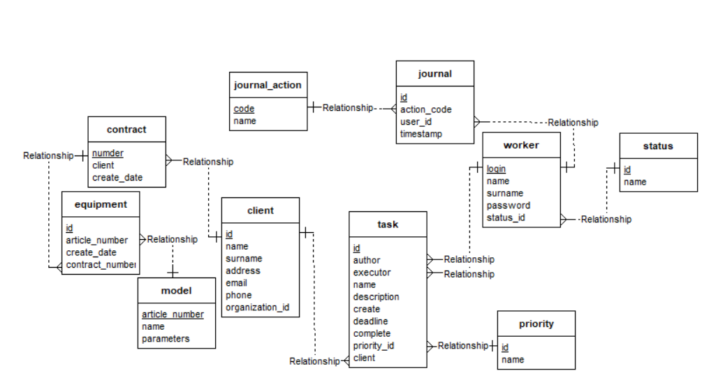
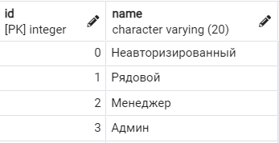
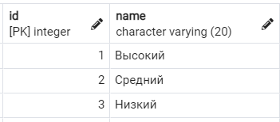
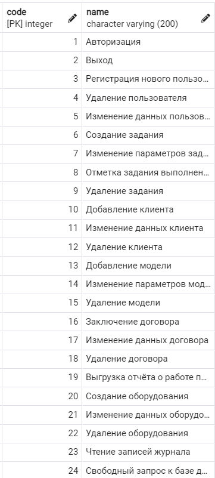

# Лабораторная №2-5 - Управление контактами с клиентами
**Работы в рамках дисциплины:**

[Клиент-серверные системы управления базами данных](../README.md) 

**Предыдущая работа:**

[Лабораторная №1 - Работа со сторонними базами данных. Построение и оптимизация](Лабораторная%20№1%20-%20Работа%20со%20стороннними%20базами%20данных.%20Построение%20и%20оптимизация.md) 

**Следующая работа:**

[Лабораторная №6-7 - Разработка интерфейса взаимодействия с информационной системой](Лабораторная%20№6-7%20-%20Разработка%20интерфейса%20взаимодействия%20с%20информационной%20системой.md)

**Код:**

* [lab2-5.sql](../sql/lab2-5.sql)
* [db_manager.py](./labs_code/db_manager.py)

---

## Тех. задание

Компания, поставляющая оборудование, в рамках обеспечения своей коммерческой деятельности нуждается в системе управления контактами со своей клиентурой. Клиенты делятся на два вида: текущие – те, с которыми у компании заключены договора в текущий момент или ранее, и потенциальные.

Система управления контактами находится в распоряжении всех работников компании. Система поддерживает функции "постоянного контакта" с наличной и потенциальной клиентской базой, так, чтобы откликаться на ее нужды, получать новые контракты, обеспечивать выполнение старых. Система позволяет сотрудникам планировать задания, которые необходимо провести в отношении контактных лиц. 

Система хранит имена, номера телефонов и факсов, почтовые и электронные адреса и т.д. организаций и контактных лиц в этих организациях.

Каждое задание связано с каким-либо контактным лицом. Примерами заданий являются телефонный звонок, визит, отправка факса, отправка электронного сообщения, проведение презентации и т. д. Некоторые задания связаны с выполнением контракта, например, отправка оборудования, поставка, установка, гарантийный и послегарантийный ремонт. В таких заданиях указывается необходимая информация: номер контракта, серийный номер ремонтируемого оборудования. Каждое задание имеет дату создания – время внесения ее в систему. Некоторые задания имеют срок исполнения – период времени от начальной даты до финальной, другие являются бессрочными. Дата создания задания не может изменяться, а срок исполнения – может. По исполнении задания дата и время его завершения фиксируются.

Каждое задание имеет автора – сотрудника, который его создал. Исполнителем задания может быть сотрудник, не являющийся автором. Рядовые сотрудники не могут назначать задания. Менеджеры назначают задания себе или кому-либо из рядовых сотрудников. Менеджер в ходе выполнения созданного им задания может поменять исполнителя.

Просматривать задание, автором которого является менеджер, может либо автор, либо исполнитель задания. Должен быть реализован приоритет каждого задания (низкий, средний, высокий). Каждый менеджер может помимо своих задача просматривать задачи рядовых сотрудников. Помечать задание как выполненное и указывать дату завершения может либо автор, либо исполнитель задания. Вносить какие-либо другие изменения в задание может только автор. После завершения задания внесение в него изменений не допускается. По прошествии 12 месяцев после даты завершения задания сведения о нем удаляются из системы.

Администратор системы управляет доступом сотрудников: выдает логины и пароли пользователям, формирует две группы пользователей: менеджеров и рядовых сотрудников. Он также имеет доступ к специальным функциям, например, может изменить автора задания или внести изменения в завершенное задание.

Система имеет возможности для поиска в базе клиентов и контактных лиц по их атрибутам (названию, городу, имени контактного лица). Система генерирует отчет по исполнению заданий каким-либо сотрудником в течение периода времени, указываемого в параметре отчета. В отчете указывается: общее количество заданий для данного сотрудника в указанный период, сколько заданий завершено вовремя, сколько заданий завершено с нарушением срока исполнения, сколько заданий с истекшим сроком исполнения не завершено, и сколько не завершенных заданий, срок исполнения которых не истек. 

Генерация отчета должна происходить посредством выгрузки из базы данных в формат данных [Excel](https://www.microsoft.com/ru-ru/microsoft-365/excel) (например, в xls).

## ER-диаграмма

## Создание базы данных

[Смотреть код](../sql/lab2-5.sql)

## Объяснение некоторых решений относительно выбранной структуры базы данных

Таблицы `status`, `priority` хранят варианты категориальных переменных и не предназначены для дальнейшего редактирования менеджерами и рядовыми работниками. При необходимости вводить новые категории работников и категории приоритета задания может только администратор базы данных.

Адрес клиента решено было хранить одной строкой. Введение новой таблицы с адресами не реализовано для ускорения поиска по адресу и облегчения реализации проекта.

Таблица `journal` содержит данные о запросах и действиях с базами данных.

Таблица `journal_action` содержит все допустимые действия взаимодействия с базой данных, а именно:

[Каскадное удаление](https://metanit.com/sql/postgresql/2.5.php) не было реализовано намерено, так как удаление, например, модели оборудования может привести к потери всех договоров и т. п. При необходимости удаление можно выполнить только администратору в режиме свободного SQL запроса к БД.

## Реализация системы управления базой данных с помощью [Python](https://www.python.org/)

Далее при разработки системы управления БД использовать хранимые функции и реализовать взаимодействия непосредственно силами [PostgreSQL](https://www.postgresql.org/) или использовать  мощь языка программирования [Python](https://www.python.org/). Был выбран второй вариант (первый вариант разработки реализован в практических работах). При выборе варианта были учтены достоинства и недостатки хранимых функций, а именно:

Достоинства:
1)	При обработке даже небольших объёмов данных во внешнем приложении мы тратим дополнительное время на передачу по сети и преобразование данных в нужный нам формат.
2)	Меньшая вероятность [SQL injection](Лабораторная%20№8%20-%20SQL-инъекции%20в%20созданную%20базу%20данных.md)
3)	Простая отладка SQL

Недостатки:
1)	Скудность языка SQL
2)	Сложность во взаимодействии с фронтенд частью
3)	Невозможность реализации средствами хранимых функций некоторых специфических возможностей, например, генерация отчёта в [Excel](https://www.microsoft.com/ru-ru/microsoft-365/excel) (исправление: в [PostgreSQL](https://www.postgresql.org/) всё-таки можно это сделать, [смотреть как здесь](https://habr.com/ru/company/crystal_service/blog/245975/), но во всяком случае, это, на мой взгляд, не так просто как на [Python](https://www.python.org/))
4)	Прозрачность логики приложения для других разработчиков

Решено было использовать [Python](https://www.python.org/) в большей степени для взаимодействия с БД.

[Смотреть код](./labs_code/db_manager.py)