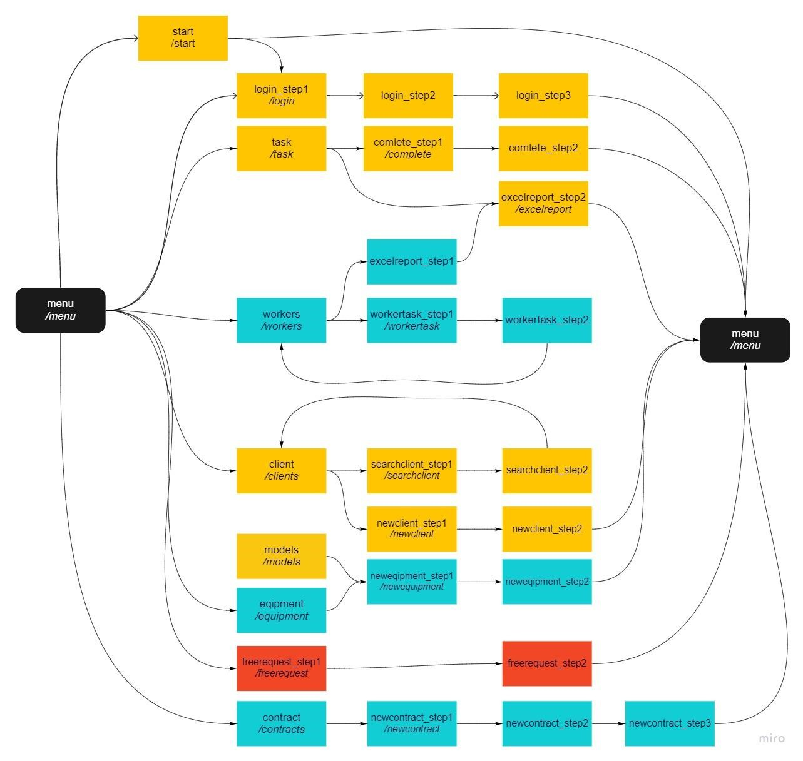
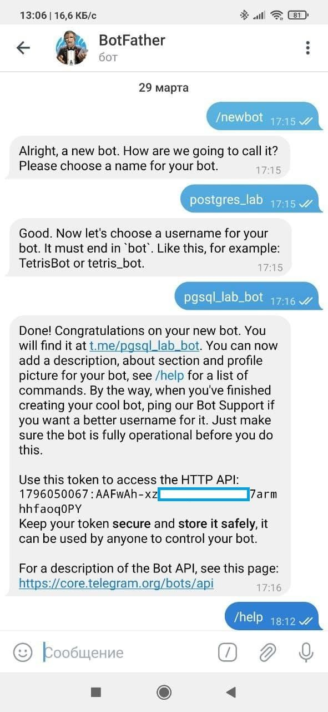
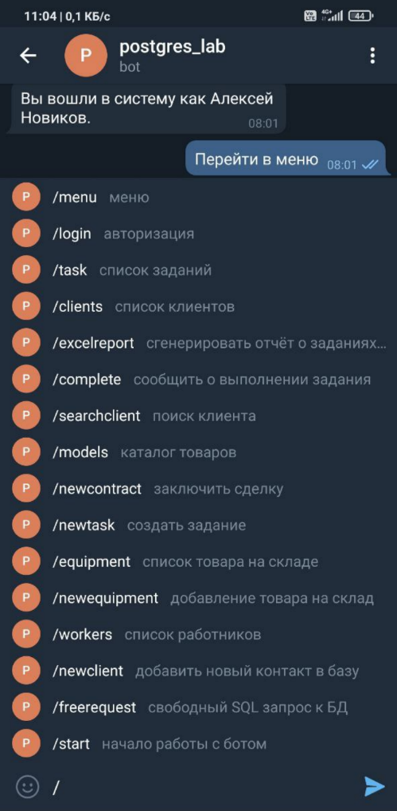
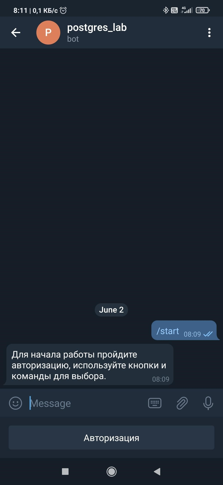
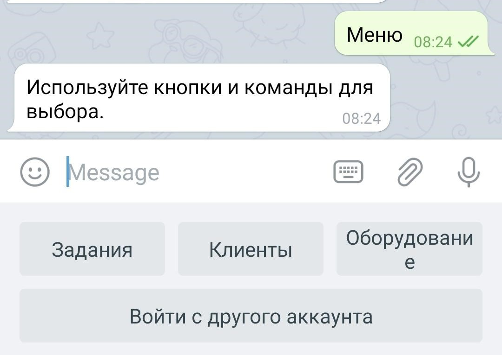
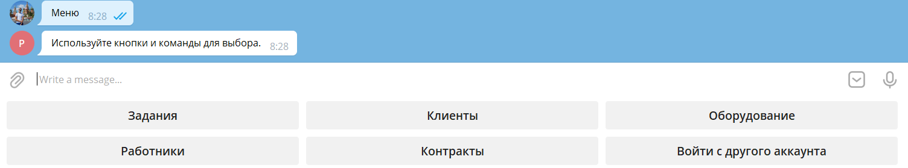
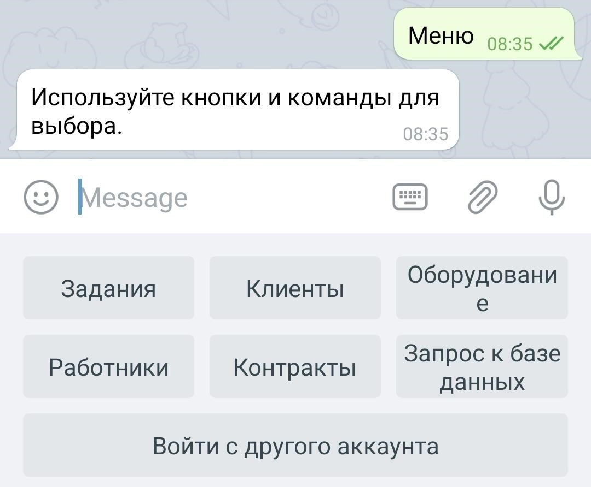
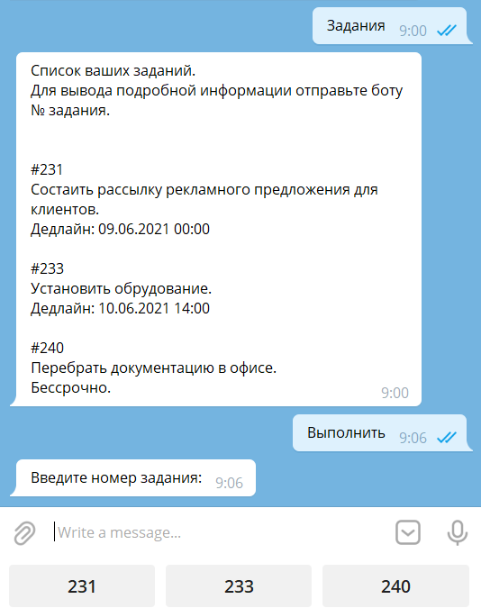
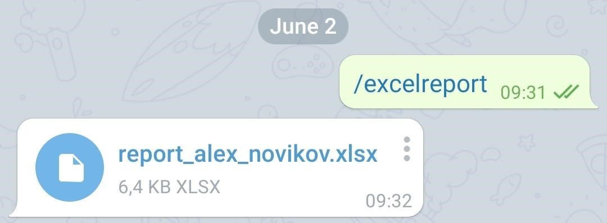

# Лабораторная работа №6-7 - Разработка интерфейса взаимодействия с информационной системой.

**Работы в рамках дисциплины:**

[Клиент-серверные системы управления базами данных](../README.md) 

**Предыдущая работа:**

[Лабораторная №2-5 - Управление контактами с клиентами](./Лабораторная%20№2-5%20-%20Управление%20контактами%20с%20клиентами.md) 

**Следующая работа:**

[Лабораторная №8 - SQL-инъекции в созданную базу данных](Лабораторная%20№8%20-%20SQL-инъекции%20в%20созданную%20базу%20данных.md)

**Код:**

* [telegram_gui.py](labs_code/telegram_gui.py)

---

Графическую оболочку системы управления базой данных было решено разработать в виде телеграмм-бота. Телеграмм позволяет осуществить кроссплатформенное управление данными. Мессенджер осуществляет шифрование данных, так что при передачи данных их не рассекретят. Бот реализован с помощью фреймворка aiogram. Данная библиотека позволяет использовать возможности asyncio для обеспечения асинхронности в работе с БД. 
При проектировании графической оболочки была создана схема состояний, в котором может находится бот:

Жёлтые состояния – это состояния, в которые бот может переходить, если у пользователя роль worker, синие - для manager пользователей, красные – для администраторов БД. Неавторизированные пользователи имеют доступ только к состояниям login и start.
Каждое состояние описано определёнными функциями в коде Python. К сожалению, телеграмм-бот будет ограничивать функционал СУБД, созданной во 2-5 лабораторной. Но телеграмм-бот по задумке должен выступать в роли мобильного клиента для работников компании и предположим, что у нас нет потребности к добавлению других специфических функций системы в бот.
Для создания бота необходимо воспользоваться специальным ботом для регистрации других ботов BotFather (@BotFather).

После того, как бот-регистратор выдал API ключ, можно уже тестировать работу кода на Python в Telegram. 
Для того, чтобы пользователь быстрее мог переходить к нужному ему функционалу бота, через BotFather были созданы быстрые команды. При введении “/” пользователю сразу же выводится подсказка как на скриншоте ниже.

Важнейшим процессом в работе приложения является авторизация пользователя. 

Для разных категорий пользователей должно выводится своё собственное меню. Вот, например вывод меню для простых работников:

А вот вид меню с desktop-клиента у менеджера.

И самое полное меню у администратора.

Меню заданий работника выглядит следующим образом:

Если количество заданий не больше, чем максимально возможное количество кнопок на экране, то для удобства генерируются кнопки с номерами заданий. Задания сортируются в порядке истечения дедлайнов и приоритета. 
Так выглядит вызов отчёта по заданиям в Excel. Бот генерирует на сервере файл, отправляет его, а затем удаляет его на сервере. Имя генерируется путём добавления к "report_" логина пользователя. 

Для того, чтобы админу или менеджеру вызвать отчёт о другом пользователе, ему необходимо делать это с помощью кнопок через меню.
