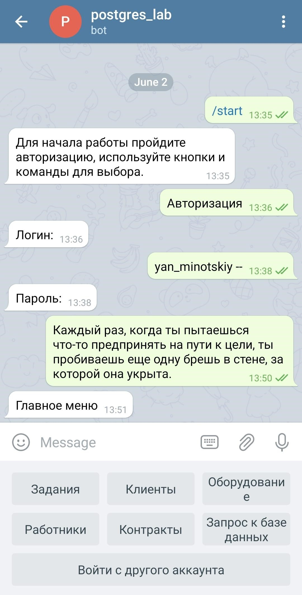

# Лабораторная №8 - SQL-инъекции в созданную базу данных

**Работы в рамках дисциплины:**

[Клиент-серверные системы управления базами данных](../README.md) 

**Предыдущая работа:**

[Лабораторная №6-7 - Разработка интерфейса взаимодействия с информационной системой](Лабораторная%20№6-7%20-%20Разработка%20интерфейса%20взаимодействия%20с%20информационной%20системой.md)

---

Теперь испытаем разработанную систему на устойчивость к SQL инъекциям. В СУБД запрос к базам данных принимается формате строки и имеет слабую защиту. В работе не был подключен специальный обработчик SQL  с защитой от инъекций. Так как у нас есть много функций, которые используют SELECT запрос, можно применить Union Based SQL-injection - классическая и очень опасная атака. 


В программе есть следующая функция, обрабатывающая процесс авторизации, которая на вход принимает данные `login` и `password`.

```python
def authorization(self, login, password):
        self.cursor.execute("SELECT login FROM worker "
                            "WHERE login=%s AND password=%s", (login, password))
        res = self.cursor.fetchall()
        if res != []:
            self.user = self.User(res[0])
            self.write_log(1)
            return True
```

Предположим, мы знаем логин одного из пользователей, но не знаем пароля. В таком случае у нас есть вариант с помощью SQL-инъекции получить доступ к системе от лица этого пользователя. В таком случае боту передаём на вход логин с припиской `--`. Так, всё, что стоит в запросе поле логина, будет закомментировано. 



В результате запроса программа получит одну строку (не ноль), а значит даст пользователю разрешение на вход со всеми вытекающими последствиями. Получив доступ к инструменту запроса к БД, злоумышленник может манипулировать данными как захочет (менять, удалять  и т. д.). Простым запросом `SELECT * FROM worker;` , например, можно достать все сведения о работниках их должностях и паролях.

К атакам типа Error-Based бот устойчив, так как в случае ошибки базы данных просто не будет ответа и узнать какую-либо информацию не получится.

Для обработки SQL-запросов безопаснее всего использовать специальные фреймворки, которые устойчивы к инъекциям, например, SQLAlchemy. В таких библиотеках уже реализована защита от инъекций и ввести спец. символы в запрос для взлома БД просто так не получится.
