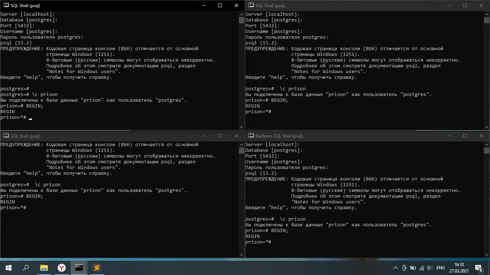
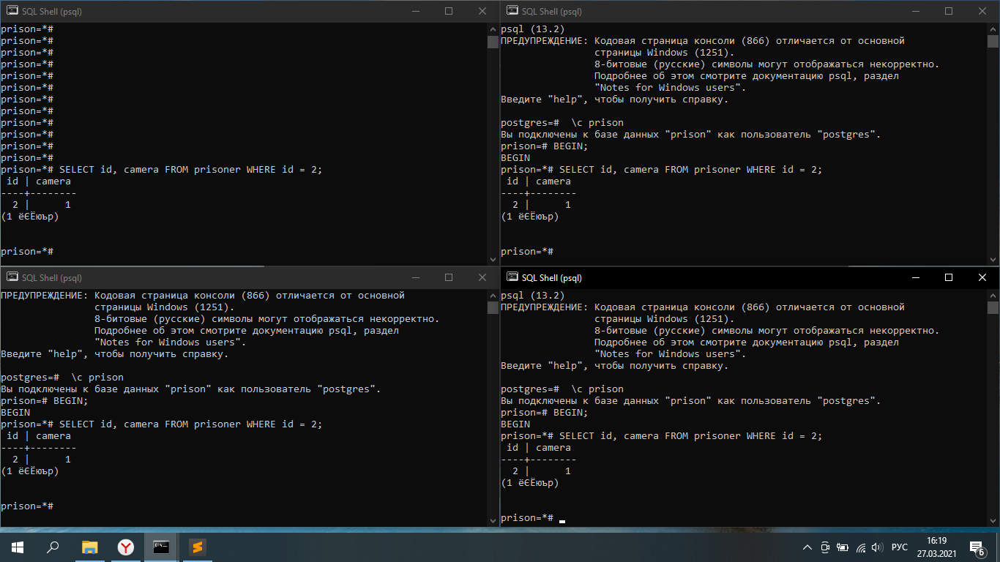
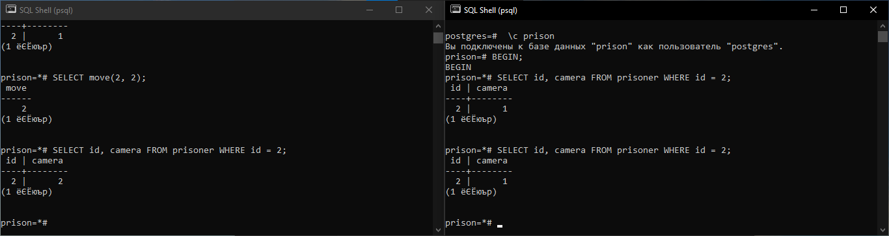
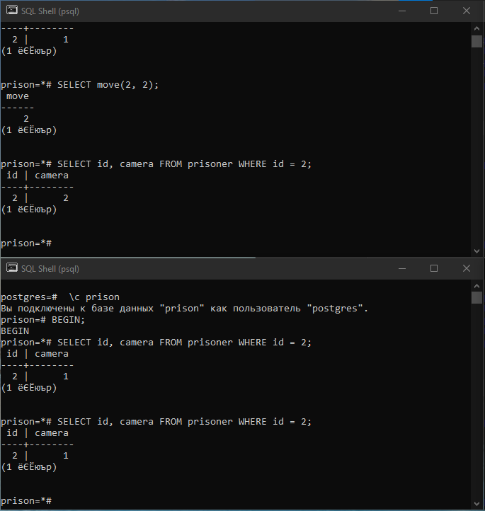
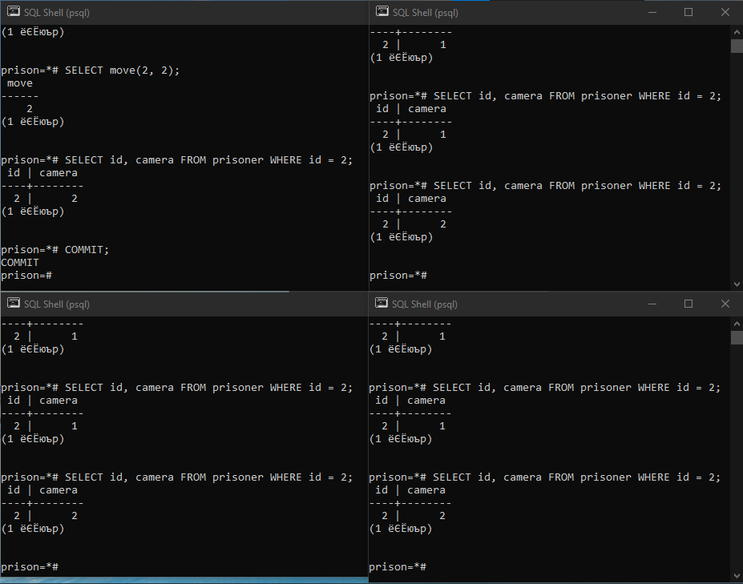
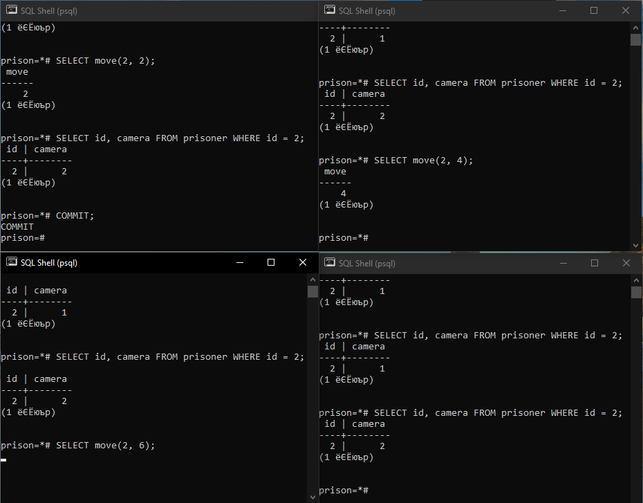
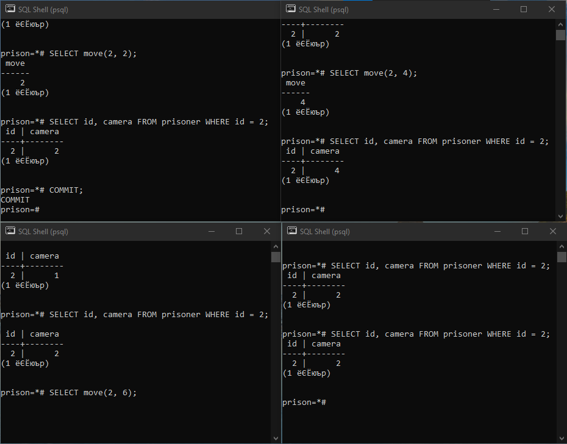
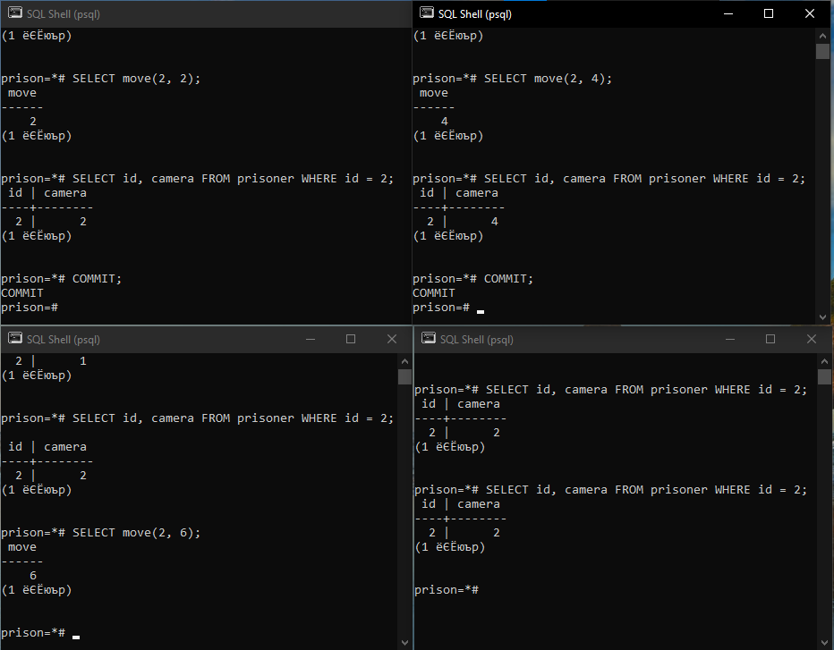
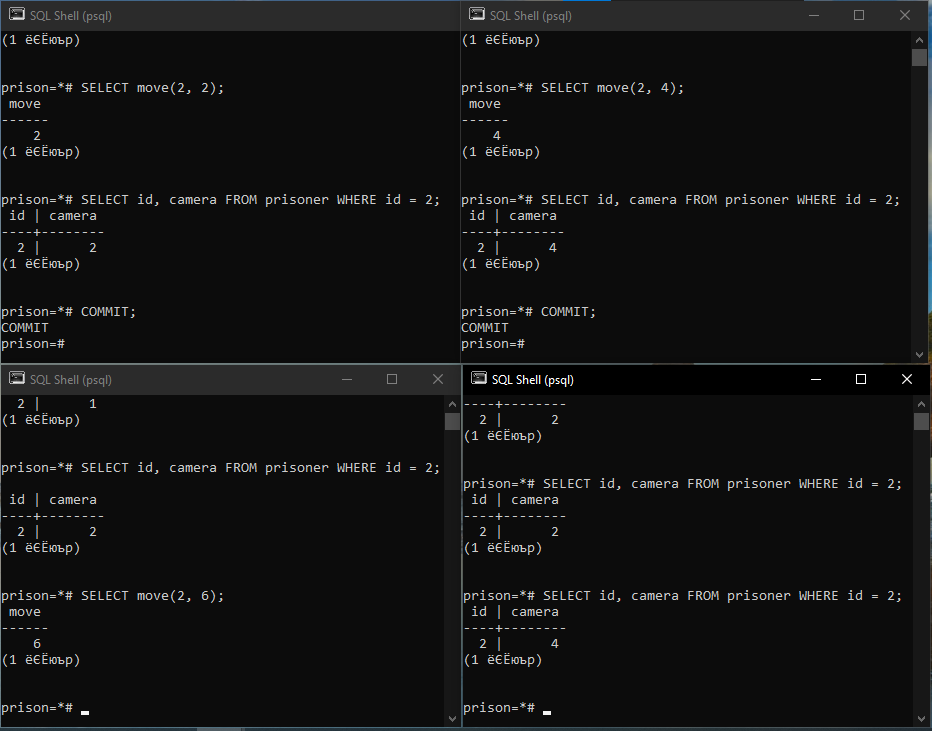
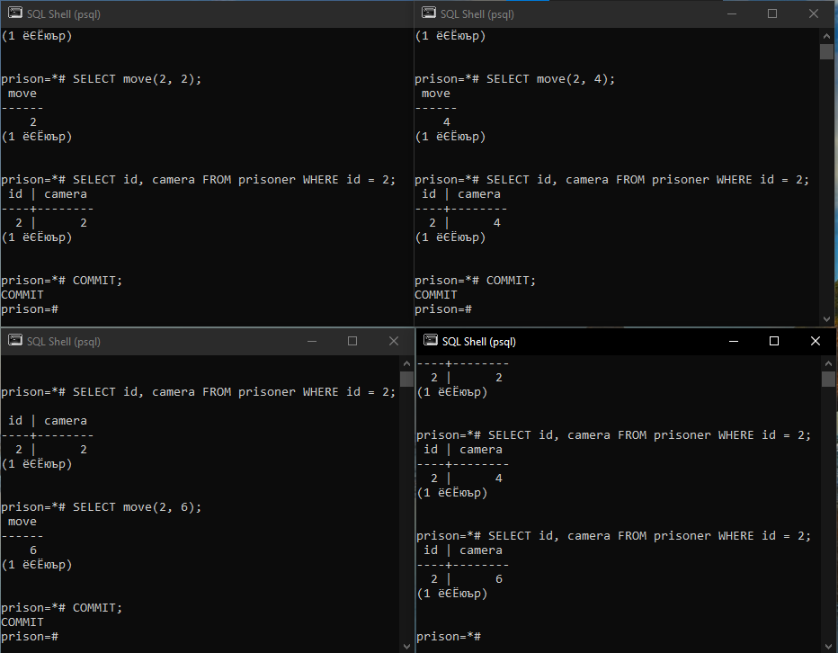

# Практика №4 - Работа с транзакциями

**Работы в рамках дисциплины:**

[Клиент-серверные системы управления базами данных](../README.md) 

**Предыдущая работа:**

[Практика №3 - Администрирование](./Практика%20№3%20-%20Администрирование.md) 

**Следующая работа:**

[Практика №5 - Работа с группами ролей и ролями](./Практика%20№5%20-%20Работа%20с%20группами%20ролей%20и%20ролями.md)

**Полезная статья на тему транзакций, на основе которой была выполнена работа:**

[Уровни изоляции транзакций с примерами на PostgreSQL](https://m.habr.com/ru/post/317884/)

---

## Задание

В [реализованную по выбору базу данных](./Практика%20№3%20-%20Администрирование.md) добавить 3 уникальные транзакции, одна из которых должна выводить ошибку любого уровня исключения(например, "грязное чтение" или фантомное чтение)

## Ход работы

1. Сделали 4 подключения и в каждом открыли по транзакции.

2. В начальный момент всем транзакциям доступна изначальная версия данных.

3. В первой транзакции обновили данные, но это обновление видно только ей, в остальных транзакциях обновление **НЕ** видно.

4. Как только закрываем первую транзакцию, сразу обновления доступны остальным транзакциям.

5. Обновление данных во второй транзакции блокирует другие изменения, например, в третьей транзакции.

6. Несмотря на то, что третья транзакция ожидает закрытия второй, четвертая и вторая прекрасно функционируют.

7. Закрытие второй транзакции приводит к разблокированию данных для изменения.

8. До закрытия третьей транзакции, данные будут удалёнными только внутри третьей транзакции. 

9.  Закрытие третьей транзакции, как следствие возникает фантомное чтение, т. е. транзакция повторно выполняет запрос, возвращающий набор строк для этого же условия, и обнаруживает, что набор строк, удовлетворяющих условию, изменился из-за транзакции, завершившейся за это время.

