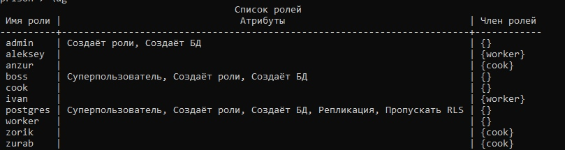

# Практика №5 - Работа с группами ролей и ролями

**Работы в рамках дисциплины:**  
[Клиент-серверные системы управления базами данных](../README.md)   
**Предыдущая работа:**  
[Практика №4 - Работа с транзакциями](./Практика%20№4%20-%20Работа%20с%20транзакциями.md)   
**Следующая работа:**  
[Практика №6 - Работа с индексами](Практика%20№6%20-%20Работа%20с%20индексами.md)  
**Полный SQL код:**  
[practic5.sql](../sql/practic4.sql)

---

## Задание

В [текущую базу данных](./Практические%20работы/Практика%20№4%20-%20Работа%20с%20транзакциями.md) создать минимум 3 группы роли пользователей с различных функционалом:
1. Одна группа ролей должна иметь права\привилегии на создание\изменение и редактирование существующей базы данных
2. Вторая группа ролей должна иметь права\привилегии на редактирование определенных таблиц в базе данных, к остальным - на чтение
3. Третья группа ролей должна иметь права\привилегии только на чтение определенных таблиц, остальные для группы должны быть недоступны
4. В каждой группе ролей должна быть минимум одна роль
5. Каждая роль должна совершать в базу данных как минимум одну транзакцию (можно использовать транзакции с [практической работы №4](./Практика%20№4%20-%20Работа%20с%20транзакциями.md))

## Ход работы

### Группа ролей, имеющая права\привилегии на создание\изменение и редактирование существующей базы данных

```SQL
CREATE USER boss PASSWORD '123';
ALTER ROLE boss WITH createrole createdb superuser;

GRANT SELECT, INSERT, UPDATE, DELETE ON ALL TABLES IN SCHEMA nutrition TO cook;
grant usage on schema nutrition to cook;
grant create on schema nutrition to cook;

REVOKE ALL PRIVILEGES ON nutrition.food_intake FROM cook1;
REVOKE ALL PRIVILEGES ON nutrition.food_sets FROM cook1;
```

### Группа ролей, которая имеет права\привилегии на редактирование 

```SQL
GRANT ALL ON prisoner TO worker;
GRANT ALL ON work_prisoner TO worker;
GRANT ALL ON work TO worker;
GRANT ALL ON category TO worker;
GRANT ALL ON prison_sentence TO worker;
```

### Третья группа ролей, имеющая права\привилегии только на чтение определенных таблиц, остальные для группы должны быть недоступны

```SQL
REVOKE ALL ON prison FROM cook;
ALTER ROLE cook NOCREATEDB NOCREATEROLE;

GRANT SELECT ON nutrition.food_sets TO cook;
GRANT SELECT ON nutrition.food_intake TO cook;
```


### Создаём в каждой группе пролей по роли.

```SQL
CREATE USER aleksey PASSWORD '123';
CREATE USER ivan PASSWORD '123';

GRANT worker TO aleksey, ivan;

CREATE USER anzur PASSWORD '123';
CREATE USER zurab PASSWORD '123';
CREATE USER zorik PASSWORD '123';

GRANT cook TO anzur, zurab, zorik;
```
**В итоге получили:**

