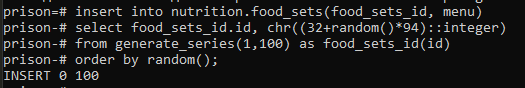
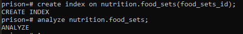
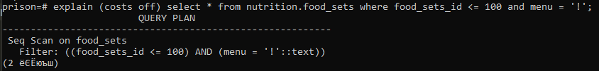
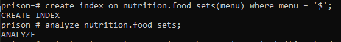
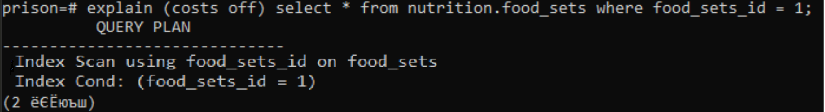
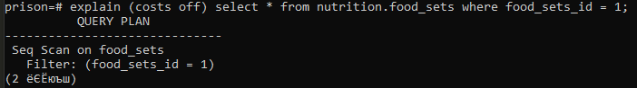

# Практика №6 - Работа с индексами

**Работы в рамках дисциплины:**

[Клиент-серверные системы управления базами данных](../README.md) 

**Предыдущая работа:**

[Практика №5 - Работа с группами ролей и ролями](./Практика%20№5%20-%20Работа%20с%20группами%20ролей%20и%20ролями.md) 

**Следующая работа:**

[Практика №7 - Резервное копирование базы данных](./Практика%20№7%20-%20Резервное%20копирование%20базы%20данных.md) 

**Материал на основе которого выполнено задание:**

[Индексы в PostgreSQL — 1](https://habr.com/ru/company/postgrespro/blog/326096/#:~:text=Индексы%20в%20PostgreSQL%20—%20специальные,заново%20по%20информации%20в%20таблице)

---

## Задание

Заполнить существующие в базе данных таблицы случайными данными (по 100 кортежей минимум) с использованием функций-генераторов и добавить к этим данным индексы,  многоколоночные индексы и частичные индексы.
Провести индексное сканирование, последовательное сканирование и сортировку таблиц с индексами

## Ход работы

Сгенерировали 100 строк и вставили в таблицу.

Добавили к этим данным индексы.

 
Работа с многоколоночными индексами. *Кодировку в консоли не меняли* :(
 
 

Частичные индексы (индексируем только часть строк таблицы, это может быть полезно в ситуациях с неравномерными распределениями)  
Произвели индексное сканирование.
 

Произвели последовательное сканирование.
 

Сортировка таблиц с индексами

