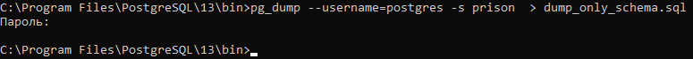
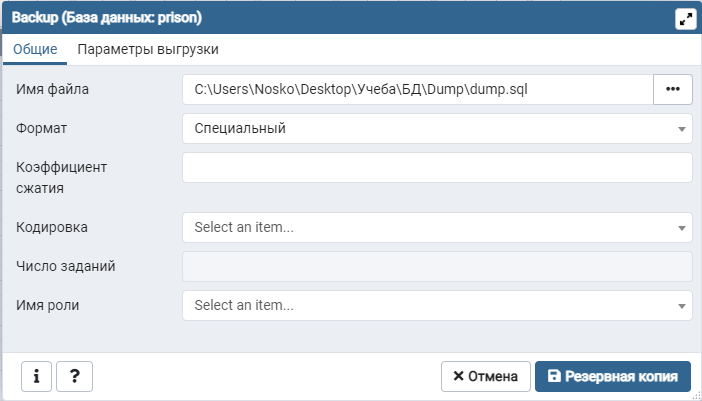
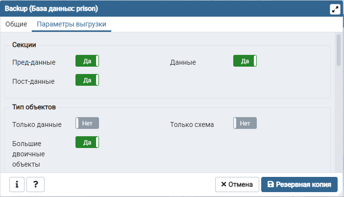
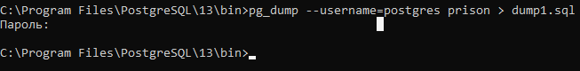
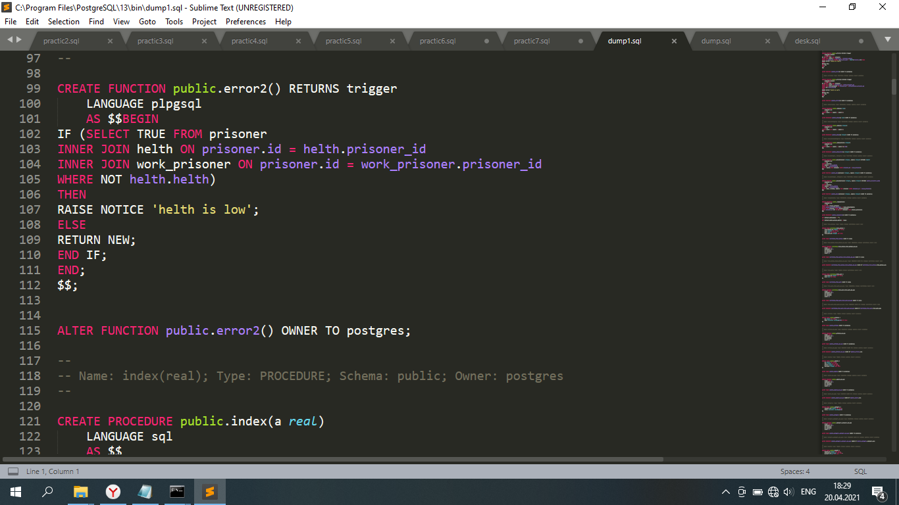
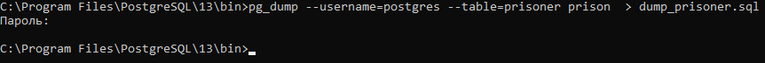
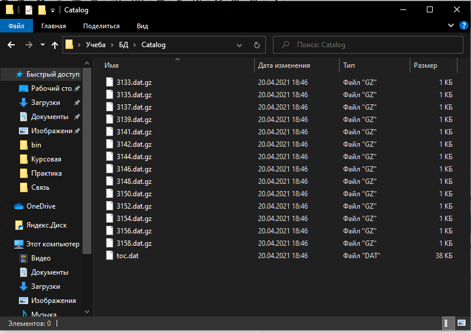

# Практика №7 - Резервное копирование базы данных

**Работы в рамках дисциплины:**

[Клиент-серверные системы управления базами данных](../README.md) 

**Предыдущая работа:**

[Практика №6 - Работа с индексами](./Практика%20№5%20-%20Работа%20с%20группами%20ролей%20и%20ролями.md) 

**Следующая работа:**

Практика №8 - Сбор статистики базы данных

**Вспомогательный материал:**

[10 способов сделать резервную копию в PostgreSQL](https://habr.com/ru/post/222311/е)

---
## Задание

1. Создать дамп схемы базы данных 
2. Создать дамп базы данных двумя способами - через SSH и через GUI
3. Создать дамп определенной таблицы из базы данных
4. Сделать резервирование в каталог (размещение каждой таблицы в отдельный файл)
5. Создать скрипт для автоматического резервного копирования*
6. Создать новую базу данных и вставить туда один из созданных дампов для проверки работоспособности

## Ход работы

### Создание дампа схемы

### Дамп БД с помощью графического интерфейса

### Создание новой БД и вставка туда созданного дампа

Сам файл дампа выглядит так:

### Дамп таблицы

### Резервирование в каталог

Разместили каждую таблицу в отдельный файл.

