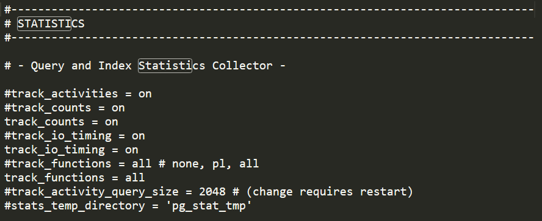
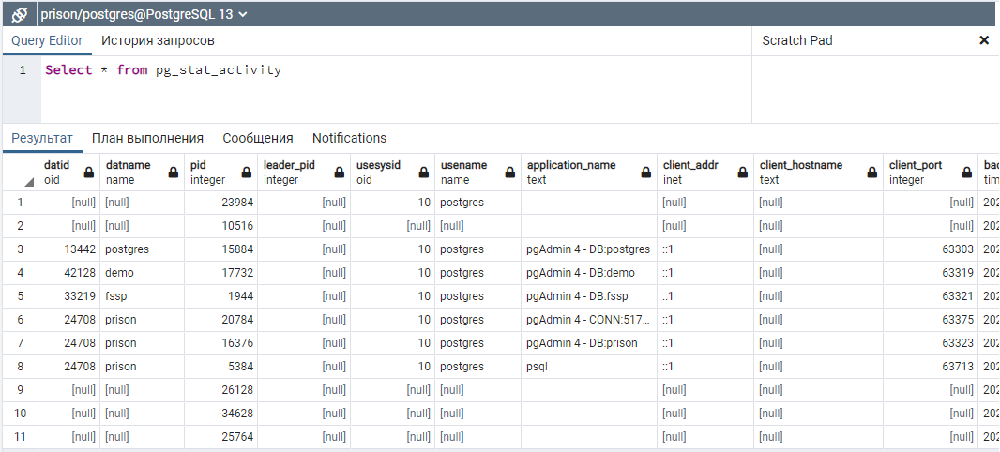
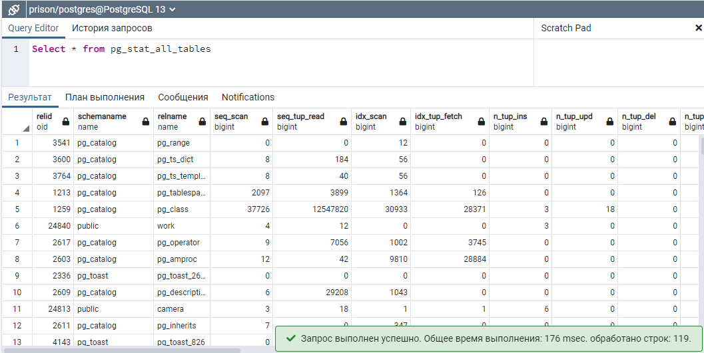
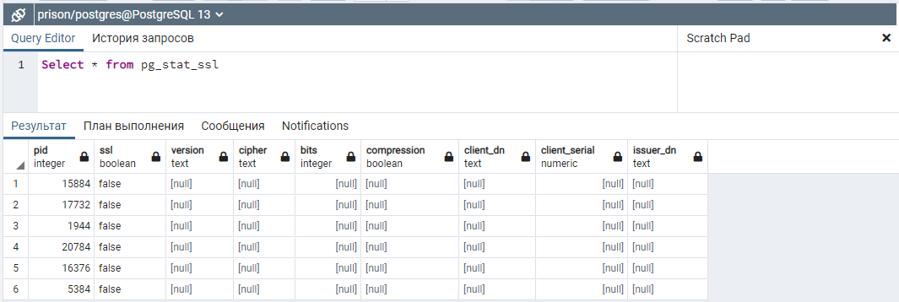
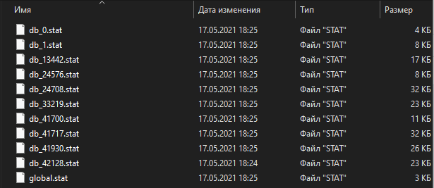
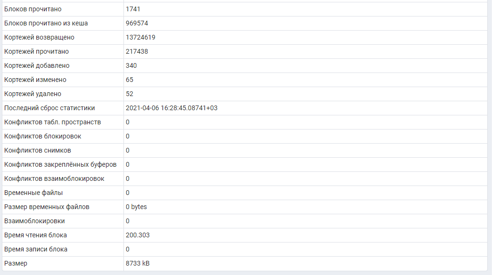
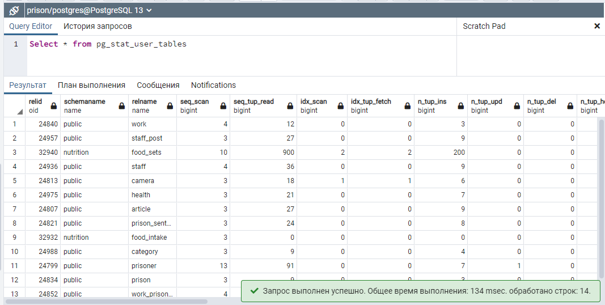
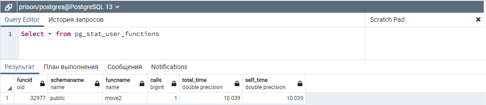
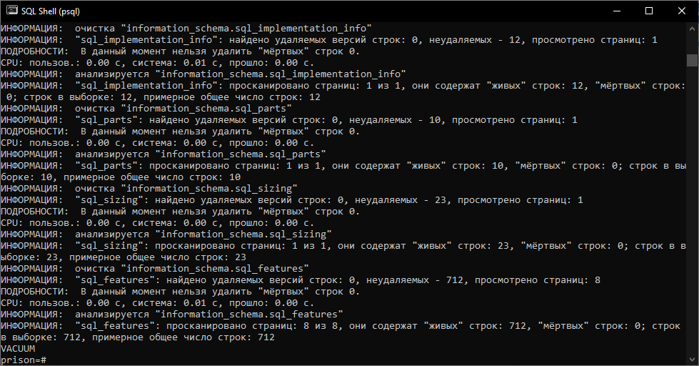
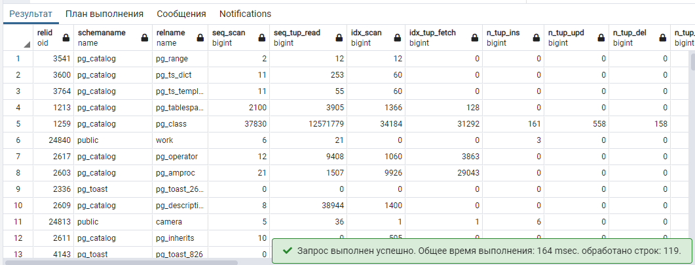

# Практика №8 - Сбор статистики базы данных

**Работы в рамках дисциплины:**  
[Клиент-серверные системы управления базами данных](../README.md)   
**Предыдущая работа:**  
[Практика №7 - Резервное копирование базы данных](Практика%20№7%20-%20Резервное%20копирование%20базы%20данных.md)   


---

1. Настроили СУБД на сбор статистической информации на сбор статистики по обращениям к таблицам и индексам, по отслеживанию пользовательских функций, по времени чтения и записи блоков.

C:\Program Files\PostgreSQL\13\data\postgresql.conf

```
#track_activities = on
#track_counts = on
track_counts = on
#track_io_timing = on
track_io_timing = on
#track_functions = all # none, pl, all
track_functions = all
#track_activity_query_size = 2048 # (change requires restart)
#stats_temp_directory = 'pg_stat_tmp'
```



2. Просмотрели текущее состояние системы с помощью предопределенных представлений (3 любых представления)









3. Собрали статистику по обращениям к таблицам и индексам, по отслеживанию пользовательских функций, по времени чтения и записи блоков.







4. Избавились от мусорных данных ("мертвые кортежи" и т. д.) с помощью операторов [PostgreSQL](https://www.postgresql.org/)

`vacuum(full, verbose, analyze);`



5. Повторно собрали статистику

